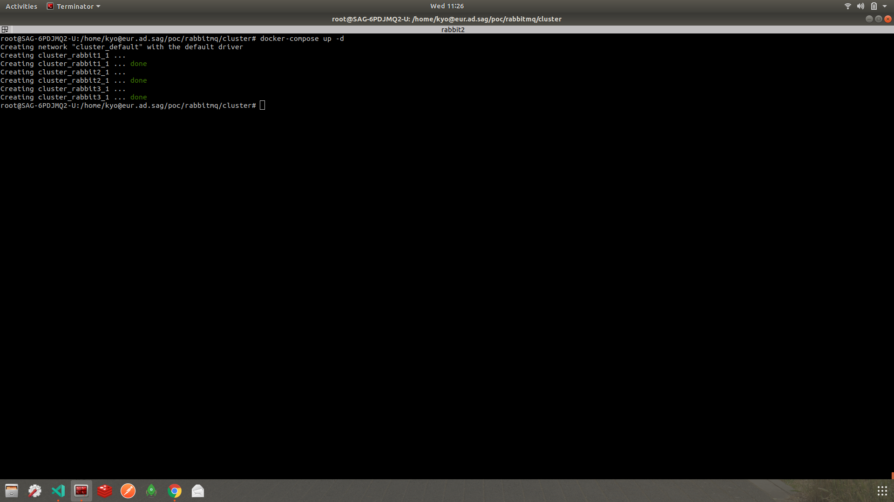
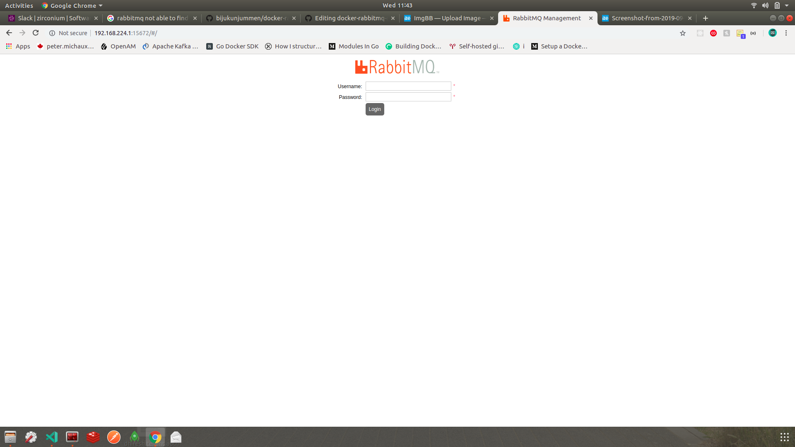
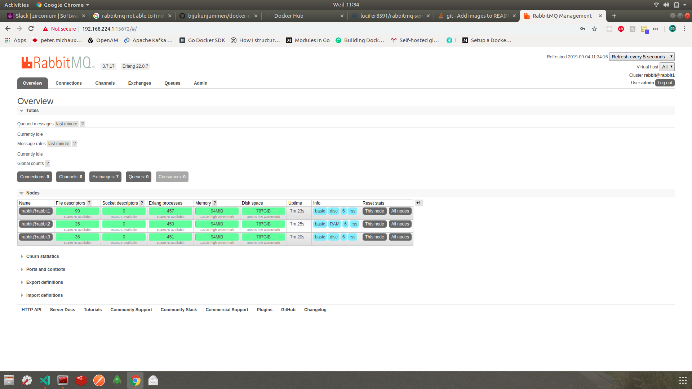
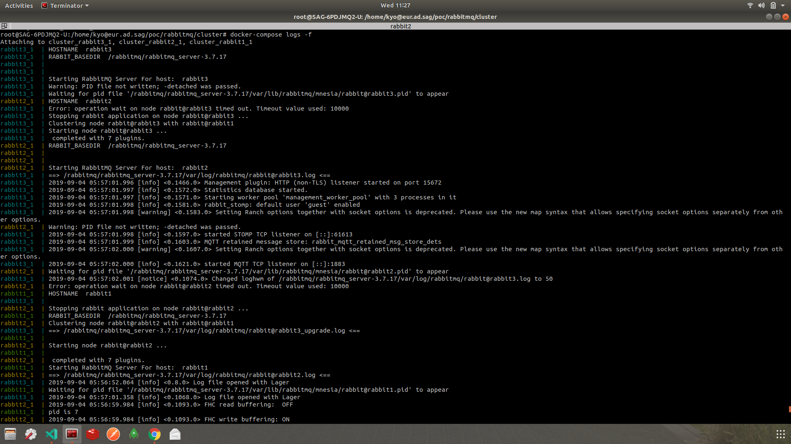

## RabbitMQ Cluster
Docker images to run RabbitMQ cluster. It uses RabbitMQ 3.7.17 for deploying set of 3 nodes rabbit1, rabbit2, rabbit3.
Number of nodes are configurable.

## Resources

There are 3 folders.

- base :   It contains the Dockerfile to download and build rabbitmq base image
- erlang:  It contains the Dockerfile to build erlang-alpine that will be used by RabbitMQ
- server:  It contains the Dockerfile to build RabbitMQ server. It used rabbitmq_base as base image
- cluster: It contains docker-compose file to launch the cluster of RabbitMQ nodes

## Usage

For running RabbitMQ Single node follow below steps
```
  docker pull lucifer8591/rabbitmq-server:3.7.17
  docker run  lucifer8591/rabbitmq-server:3.7.17
```

Visit the http://<docker-ip>:15672 to view management console

NOTE:
guest user will not be able to login to management ui as it supports only localhost

### Environment Variables
RABBITMQ_DEFAULT_USER: Set default Administrator user ```default admin```
RABBITMQ_DEFAULT_PASS: Set password for default user ```default admin```

### Running Cluster
Add docker-compose file available in cluster directory to your project directory and run below command

```
docker-compose up -d

```

### Clusters Launching Progress 


### Management UI
Manage UI is accssible using localhost:15672 or http://<dockerip>:15672 i.e in my case it is http://192.168.224.1:15672. You can find docker ip using docker network inspect network_name




### Management Dashboard 


### Compose Logs
To view logs when RabbitMQ is launched as screenshot
```
docker-compose logs -f 
// or for specific node logs
docker-compose logs -f rabbit1
```


### Future TODO's
- HA proxy
- Swarm deployment
- Custom logging


Happing Coding :grinning: kailashyogeshwar85
